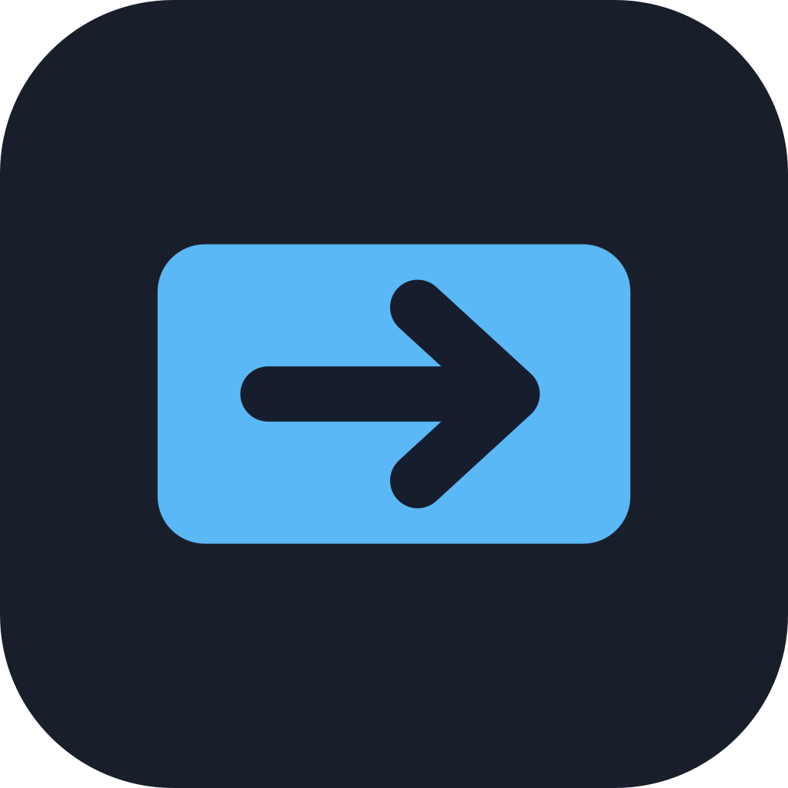

<div align="center">
  

  <h1>IRustPeek</h1>

  <p><strong>Uma agenda simples e sincronizável para abrir máquinas do RustDesk com um clique.</strong></p>
  <p>Sem conta paga, sem planilha solta, sem decorar ID de máquina.</p>

  <p>
    
    
    
    
    
  </p>
</div>

---

## 🧭 O problema

RustDesk e TeamViewer continuam ótimos para acesso remoto, mas as contas gratuitas ficaram limitadas demais para uma necessidade básica: manter uma lista pequena de máquinas próprias, sincronizada entre computadores, e abrir uma conexão rapidamente.

Pra quem cuida de três, quatro ou cinco máquinas pessoais, a falta de uma agenda vira fricção boba: copiar ID em nota, lembrar qual Mac é qual, abrir o RustDesk manualmente, conferir número, clicar, repetir.

## ✨ A solução

IRustPeek é uma agenda discreta para RustDesk. Ele fica na barra de menu do macOS ou no system tray do Windows; ao clicar no ícone, mostra suas máquinas salvas. Um clique na máquina chama `rustdesk://<id>` e abre o RustDesk direto na conexão certa.

O app não tenta substituir o RustDesk. Ele só entrega a camada que ficou faltando: uma lista simples, sincronizável e rápida.

## 🎯 Features

- 🖥️ **Agenda de máquinas** — nome amigável, ID do RustDesk, tags e notas
- ⚡ **Abrir com um clique** — chama o protocolo `rustdesk://<id>` direto pelo sistema
- 🪟 **Menu rápido** — painel bonito no ícone da barra com lista, sincronização e saída
- ⚙️ **Janela de configurações** — cadastro, edição, busca e escolha do serviço de sync
- ☁️ **Sincronização por arquivo** — iCloud Drive, Google Drive ou OneDrive, sem OAuth
- 🔁 **Fluxo seguro ao trocar de serviço** — se o novo destino estiver vazio, mantém a lista em tela e grava só quando você clicar em sincronizar
- 🚀 **Iniciar com o sistema** — toggle para abrir junto com macOS/Windows
- 🍎 **macOS universal** — build para Intel (`x86_64`) e Apple Silicon (`arm64`)
- 🪶 **Ícone nativo no macOS** — Dock/Finder colorido, menu bar em template icon adaptado ao tema

## ⚙️ Como usar

1. Abra o IRustPeek
2. Clique em **Configurações** pelo ícone perto do relógio
3. Escolha o serviço de sincronização: **iCloud Drive**, **Google Drive** ou **OneDrive**
4. Cadastre suas máquinas com nome e ID do RustDesk
5. Clique no ícone da barra e escolha uma máquina para conectar

O IRustPeek grava um arquivo `IRustPeek/address-book.json` dentro do serviço escolhido. A sincronização real é feita pelo app de nuvem que já está instalado no sistema.

> **Requisito do protocolo `rustdesk://`.** O clique em "Conectar" só funciona com o **RustDesk instalado**, que é quem registra o esquema de URL `rustdesk://`. No macOS isso é automático após a primeira execução do RustDesk; no Windows o instalador do RustDesk registra o handler.

## 📦 Instalação

1. Baixe o `.app` ou `.dmg` da página de [Releases](https://github.com/fredwilliamtjr/IRustPeek/releases)
2. Mova o `IRustPeek.app` para a pasta **Aplicativos**

> **macOS — liberar o app na primeira abertura.** Como o app não é notarizado pela Apple, ao baixá-lo da internet o macOS pode bloquear com a mensagem *"não foi possível verificar se está livre de malware"*. Depois de mover o app para a pasta **Aplicativos**, rode no Terminal:
>
> ```bash
> xattr -dr com.apple.quarantine "/Applications/IRustPeek.app"
> ```
>
> Pronto — agora é só abrir normalmente. Alternativa pela interface: **Ajustes do Sistema → Privacidade e Segurança → Abrir Mesmo Assim**.

## 🧱 Arquitetura

```
IRustPeek/
├── src/
│   ├── main.js              # Processo principal Electron, tray, sync e janela
│   ├── preload.js           # Ponte segura IPC para renderer/tray
│   ├── renderer/            # Janela de configurações
│   ├── tray/                # Painel rápido da barra/menu
│   └── assets/              # Ícone colorido + template icon macOS
├── scripts/
│   └── generate_icon.swift  # Gera icon.icns, icon.png e StatusTemplate.png
├── build/                   # Assets usados pelo electron-builder
└── docs/                    # Imagens do README
```

| Componente | Responsabilidade |
|---|---|
| `main.js` | Tray, janelas, seleção de provedor, leitura/gravação do catálogo e abertura do RustDesk |
| `renderer/` | Tela de configuração: máquinas, busca, edição, sync e launch at login |
| `tray/` | Menu rápido customizado, com lista de máquinas, sincronização e sair |
| `preload.js` | API segura exposta para as telas via `contextBridge` |
| `generate_icon.swift` | Geração dos assets de ícone para Dock/Finder e menu bar |

## 🔁 Sincronização

A escolha do serviço é intencionalmente simples:

- **iCloud Drive** no macOS
- **Google Drive** quando a pasta local do Drive existe
- **OneDrive** quando a pasta local do OneDrive existe

Se o serviço escolhido já tiver máquinas, o IRustPeek carrega essa lista. Se estiver vazio, ele mantém a lista atual em tela e só grava no novo serviço quando você clicar em **Sincronizar**.

## Formato do arquivo

```json
{
  "version": 1,
  "updatedAt": "2026-05-30T18:00:00.000Z",
  "devices": [
    {
      "id": "mac-mini-casa",
      "name": "Mac mini casa",
      "rustdeskId": "123456789",
      "notes": "",
      "tags": ["casa", "mac"],
      "createdAt": "2026-05-30T18:00:00.000Z",
      "updatedAt": "2026-05-30T18:00:00.000Z"
    }
  ]
}
```

## 🔨 Build a partir do código

Requisitos:

- Node.js 20+
- npm

```bash
git clone https://github.com/fredwilliamtjr/IRustPeek.git
cd IRustPeek
npm install
npm start
```

Build de teste macOS, sem DMG:

```bash
npm run build:mac:dir
```

Build universal macOS:

```bash
npm run build:mac:universal
```

O app universal sai em:

```text
release/mac-universal/IRustPeek.app
```

## 🔒 Segurança

- O IRustPeek guarda apenas IDs do RustDesk, nomes, notas e tags
- Senhas de acesso desacompanhado devem ficar no RustDesk ou num cofre dedicado
- Não há login em iCloud/Google/OneDrive; o app usa apenas as pastas locais já sincronizadas
- A gravação do catálogo usa escrita atômica para reduzir risco de corromper o JSON

## 🗺️ Roadmap

- [x] Tray/menu com lista de máquinas
- [x] Cadastro, edição e remoção
- [x] Sincronização por iCloud Drive, Google Drive e OneDrive
- [x] Launch at login
- [x] Ícone próprio + template icon macOS
- [x] Build macOS universal
- [ ] Busca rápida no menu
- [ ] Importar/exportar CSV
- [ ] Detecção melhor de conflitos
- [ ] Cofre nativo para senhas opcionais
- [ ] Instalador Windows
- [ ] Assinatura/notarização macOS

## 📄 Licença

TBD

---

<div align="center">
  <sub>Feito com ☕ por <a href="https://github.com/fredwilliamtjr">@fredwilliamtjr</a></sub>
</div>
